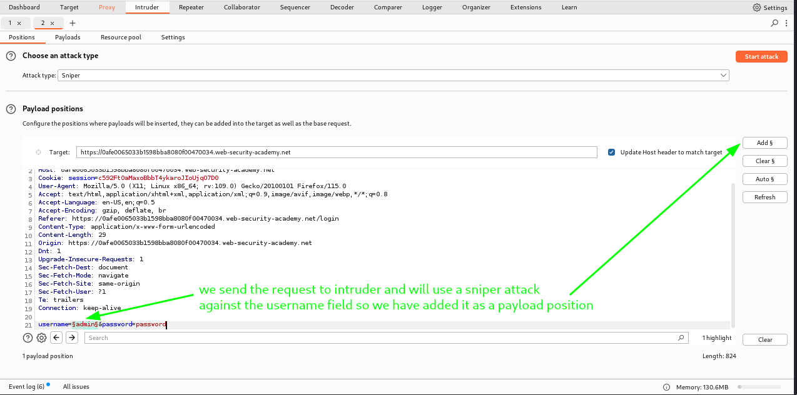
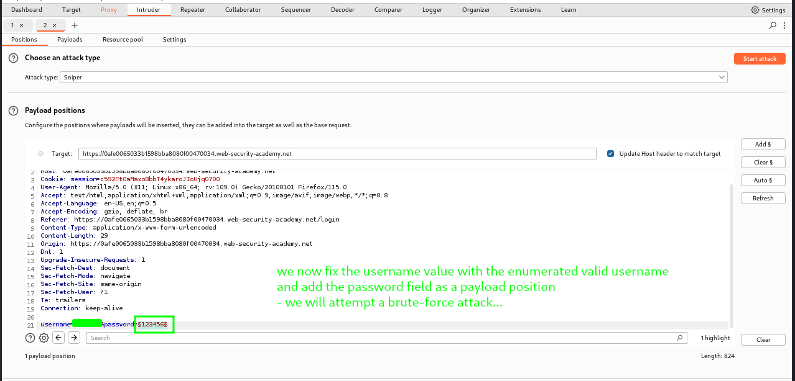
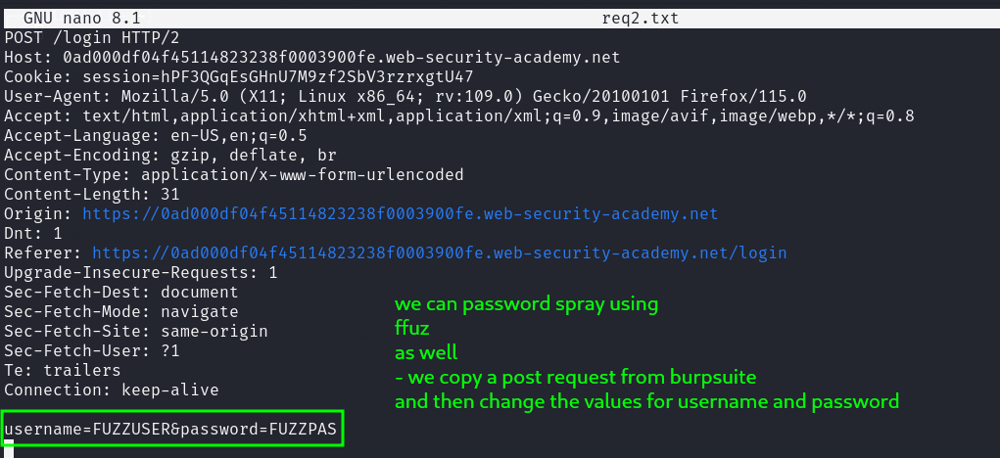
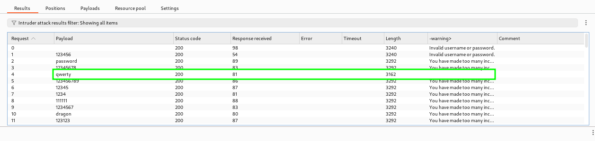
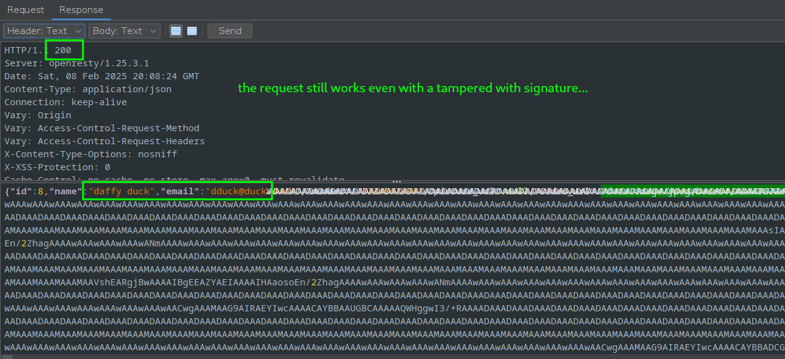

# Practical Bug Bounty

Bug bounty hunting is a proactive approach to web application security that allows ethical hackers to identify and report vulnerabilities in exchange for rewards. Companies open their applications and systems to external security researchers, creating bug bounty programs where hunters can test for flaws without fear of the feds. This collaborative model leverages the diverse expertise of the global security community, enabling companies to uncover hidden vulnerabilities before malicious actors exploit them.

Bug bounty hunting bridges the gap between organizations and skilled security researchers, providing a structured way for hunters to assist in improving security. It’s a mutually beneficial arrangement: companies benefit from increased security assurance, and hunters receive rewards, recognition (not always desirable) and the chance to legally hack stuff and hone skills. As bug bounty hunting gains traction, it has become a critical tool in the security arsenal of companies worldwide, democratizing cybersecurity and making the digital landscape more resilient.

## Why Web Application Security is Important

In today’s digital world, web applications are at the heart of many businesses, from small startups to global enterprises. These applications often hold sensitive data, manage transactions, and maintain customer trust. However, with this critical role comes a significant risk: web applications are prime targets for attackers seeking to exploit vulnerabilities. Security breaches can lead to data theft, financial loss, and serious reputational damage.

Web applications face a wide array of threats, including cross-site scripting (XSS), SQL injection, broken authentication, and exposure of sensitive data. As these threats evolve, securing applications becomes a continual process, demanding vigilance, innovation, and expertise. Protecting web applications not only shields the users and their data but also fosters trust and reliability in the application’s brand and its services.

To summarize, the following list shows why web app security is important:

- Data protection
- Maintaining customer trust
- Legal and regulatory compliance
- Preventing disruption to business
- Protecting reputation
- Preventing financial loss
- Avoiding theft of intelectual property
- Preventing identity theft

## Security Best Practices

Ensuring web application security requires a blend of well-established practices and a proactive approach to potential threats. This section outlines essential best practices that organizations should follow to secure their applications and data effectively.

### 1. Regular Patching and Updates

One of the simplest yet most crucial practices is to keep software, libraries, and systems up to date. Many vulnerabilities arise from outdated software, as attackers often exploit known weaknesses that have been patched in recent versions. Regularly updating and patching software minimizes the attack surface and ensures applications are equipped with the latest security improvements.

### 2. Principle of Least Privilege

The principle of least privilege dictates that users, applications, and services should have the minimal level of access necessary to perform their functions. Restricting permissions limits the damage an attacker can do if they gain access to a system. It also reduces the risk of accidental data exposure and helps isolate compromised accounts or services, making security breaches easier to contain.

### 3. Secure Coding Practices

Secure coding is fundamental in preventing common vulnerabilities such as SQL injection, cross-site scripting (XSS), and cross-site request forgery (CSRF). Following secure coding practices, like validating inputs, escaping output, and using prepared statements for database queries, helps eliminate weaknesses at the code level. Implementing a secure development lifecycle that includes security checks at every stage—from design to deployment is essential for maintaining a resilient application.

### 4. Secure Data Storage

Proper data storage is essential to protect sensitive information, including user credentials and personally identifiable information (PII). Best practices include encrypting data both at rest and in transit, using strong cryptographic algorithms, and ensuring data storage systems meet security standards. It’s also critical to avoid hardcoding sensitive information, such as API keys or passwords, directly in the application’s source code.

### 5. Multi-Factor Authentication (MFA)

MFA is an effective defense against unauthorized access. By requiring users to verify their identity using multiple factors (e.g., a password and a one-time code sent to their device), MFA significantly reduces the risk of account compromise, even if passwords are stolen. Implementing MFA for all users—especially those with elevated permissions is a strong security measure that helps secure login systems.

### 6. Logging and Monitoring

Logging and monitoring provide visibility into application activity, helping organizations detect potential security incidents early. Logging key events (such as login attempts, access to sensitive data, and configuration changes) enables quick identification of suspicious behavior. Regularly reviewing logs and implementing real-time monitoring with alerts on anomalous activity are essential for effective incident detection and response.

### 7. User Training and Awareness

Human error is the most common cause of security incidents. Training users on secure practices, such as recognizing phishing attempts, using strong passwords, and reporting suspicious activity, enhances the overall security posture. Regular user training sessions and awareness campaigns are effective ways to instill a security-first mindset across an organization.

## Frameworks for Web Application Testing

Frameworks for web application testing provide structured guidance for identifying, prioritizing, and addressing security vulnerabilities. Leveraging well-established frameworks ensures that common and critical vulnerabilities are not overlooked. This section covers three widely used frameworks: the OWASP Top Ten, CWE, and the SANS 25.

### 1. OWASP Top Ten

The **Open Web Application Security Project (OWASP) Top Ten** is a widely respected and regularly updated list of the most critical web application security risks. Updated every few years to reflect emerging threats, the OWASP Top Ten helps organizations focus on the most prevalent and impactful vulnerabilities. Each item on the list includes descriptions, examples, and remediation recommendations, making it an essential tool for developers, testers, and security teams.

The latest OWASP Top Ten includes risks such as:
- **Broken Access Control** – Failures in enforcing user permissions, leading to unauthorized access.
- **Cryptographic Failures** – Weaknesses in protecting data, often due to poor encryption practices.
- **Injection** – Flaws like SQL injection where malicious code is executed within the application.
  
By adhering to OWASP guidelines, organizations can systematically reduce the most common security risks in their applications.

### 2. Common Weakness Enumeration (CWE)

The **Common Weakness Enumeration (CWE)** is a community-developed list of software and hardware weaknesses that provides a more detailed view of security issues than the OWASP Top Ten. Managed by the MITRE Corporation, CWE assigns unique identifiers to specific weaknesses, enabling detailed tracking and categorization of vulnerabilities.

CWE serves as a valuable framework for:
- **Defining Security Requirements** – Mapping common weaknesses to secure coding guidelines and standards.
- **Developing Security Testing Plans** – Identifying specific flaws to test for based on application risk profile.
- **Tracking and Mitigating Known Issues** – Using CWE identifiers to consistently track vulnerabilities and remediation.

For example, CWE-79 (Cross-Site Scripting) and CWE-89 (SQL Injection) categorize and describe specific types of vulnerabilities. CWE is widely used by developers and security teams to maintain consistent language and standards for identifying and addressing weaknesses in code.

### 3. SANS 25 (CWE/SANS Top 25 Most Dangerous Software Errors)

The **SANS 25**, formally known as the **CWE/SANS Top 25 Most Dangerous Software Errors**, is a curated list of the most dangerous and impactful software weaknesses. Developed collaboratively by the SANS Institute and MITRE, the SANS 25 highlights the most serious errors that lead to severe security risks, including vulnerabilities that are both easy to find and exploit.

The SANS 25 list helps security teams:
- **Prioritize Testing** – Focusing on the most critical errors that could lead to high-impact vulnerabilities.
- **Mitigate High-Risk Issues** – Providing developers with guidance on mitigating severe vulnerabilities.
- **Standardize Security Practices** – Offering a shared language for security errors, making it easier to communicate risks and best practices.

Key vulnerabilities on the SANS 25 include buffer overflows, path traversal, and improper input validation, which can lead to a wide range of security issues. This framework is an excellent resource for focusing on vulnerabilities that have proven to be both common and damaging across applications.

## How Bug Bounty Hunting Differs from Penetration Testing

Bug bounty hunting and penetration testing are both essential approaches to identifying security vulnerabilities, but they differ significantly in scope, methodology, and focus. The primary distinction lies in the concept of *impact*: bug bounty programs are generally focused on discovering impactful, exploitable vulnerabilities, while penetration testing takes a more comprehensive approach, assessing the overall security posture of a system.

### Focus on Impact in Bug Bounty Hunting

Bug bounty hunting prioritizes vulnerabilities that present a clear, demonstrable risk to the organization. To be eligible for a reward, a reported bug must typically have an immediate impact, such as unauthorized access, data leakage, or application functionality compromise. For example, a critical finding in bug bounty hunting might be a SQL injection vulnerability that allows attackers to access sensitive data.

In contrast, penetration testing aims to assess the entire security landscape, documenting both high-impact vulnerabilities and lower-severity issues that may indicate weaknesses in the organization’s security practices. Findings in a penetration test report may include issues with limited impact on their own but that still pose security concerns, particularly when combined with other weaknesses.

### Scope and Coverage Differences

Another difference is the scope. In a penetration test, the assessment usually covers the full application or environment, providing a holistic view of security that includes infrastructure, networks, APIs, and application code. Pen testers simulate various attack scenarios to uncover vulnerabilities that could lead to a breach.

Bug bounty hunters, however, are often limited to specific parts of the application or defined assets. Organizations define the scope for bounty hunters, specifying which parts of the application they can test and often excluding certain areas. This can lead to a more targeted focus, with bounty hunters concentrating on finding high-impact bugs within allowed areas rather than a comprehensive assessment.

### Examples of Findings Exclusive to Penetration Testing

Some types of findings are commonly included in penetration testing reports but would not generally be submitted in a bug bounty program due to their low impact or limited exploitability. These findings are still valuable for strengthening overall security but do not meet the threshold for bug bounty impact. Examples include:

- **Weak Password Policy**: While a weak password policy might indicate poor security hygiene, it typically does not have an immediate exploitable impact. However, it would be documented in a penetration test report as it increases the risk of account compromise.
  
- **User Account Enumeration**: The ability to identify valid usernames through error messages or other clues (user enumeration) is often flagged in penetration testing but may not be accepted in a bug bounty program unless it is paired with a more severe vulnerability.
  
- **Outdated Software**: Running outdated software can expose an application to known vulnerabilities, yet this is typically a low-impact finding on its own. In penetration testing, outdated software versions are documented and recommended for updating, while bug bounty programs may only accept reports for outdated software if it leads to a clear, exploitable vulnerability.

### Summary

While both bug bounty hunting and penetration testing aim to strengthen application security, they serve different purposes. Bug bounty programs focus on finding impactful, exploitable vulnerabilities within a restricted scope, while penetration testing provides a broader, more systematic security assessment that covers both high- and low-severity findings across the entire application or environment.

## Understanding Scope and Ethics in Bug Bounty Hunting

### What is Scope?

In bug bounty programs, *scope* defines the boundaries of what can and cannot be tested. Scope includes specific domains, subdomains, applications, or functionalities that the organization allows researchers to test. Staying within scope is crucial for both legal and ethical reasons, ensuring that researchers don’t inadvertently break the law or disrupt services that the organization hasn’t permitted for testing.

Scope often has two main categories: *in-scope* and *out-of-scope* assets. Bug bounty programs typically provide a detailed scope document, and hunters should review this carefully before beginning any testing.

#### In-Scope Assets

In-scope assets are the parts of the application or infrastructure that the organization has explicitly approved for testing. These may include:
- **Domains and Subdomains**: Specific domains and subdomains like `www.example.com` and `app.example.com` might be listed as eligible for testing.
- **APIs**: Certain API endpoints (e.g., `api.example.com`) may be in scope, allowing hunters to assess these for security issues.
- **Mobile Applications**: Occasionally, organizations include mobile applications (Android or iOS) in their bug bounty scope.

Example of in-scope assets:
- `example.com`
- `api.example.com`
- `mobile.example.com`

#### Out-of-Scope Assets

Out-of-scope assets are explicitly excluded from testing and should not be tampered with. These often include:
- **Critical Infrastructure**: Sensitive infrastructure domains, such as corporate email systems (`mail.example.com`) or internal-only systems (`intranet.example.com`), are typically off-limits.
- **Third-Party Services**: Domains that are not directly managed by the organization, such as third-party payment processors or customer service platforms, are usually out of scope.
- **Domains Without Explicit Permission**: Any domain or asset not specifically mentioned in the in-scope list should be considered out of scope by default.

Example of out-of-scope assets:
- `mail.example.com`
- `hr.example.com`
- `backup.example.com`

Staying within the defined scope demonstrates respect for the organization’s boundaries and avoids potential legal issues.

### Guidance on Ethics in Bug Bounty Hunting

Ethics are a critical part of bug bounty hunting, guiding researchers to act responsibly and respect the organizations they’re working with. Some fundamental ethical principles include:

1. **Always Stay Within Scope**  
   Testing out-of-scope assets can lead to unintended consequences, including being vanned 🚓 If you discover a vulnerability on an out-of-scope asset accidentally, report it responsibly, but avoid further testing on it.

2. **Avoid Causing Disruption**  
   Avoid high-intensity attacks that could degrade service quality, such as DDoS, brute-force, or automated scanning without throttling. Aim to test in a way that minimizes potential disruption to the organization’s services and users.

3. **Report All Findings Honestly and Respectfully**  
   If you find a vulnerability, report it in detail but avoid exaggerating its severity. Clear, factual reporting builds trust with the organization, and respectful communication shows professionalism.

4. **Respect User Privacy**  
   Bug bounty hunting can sometimes involve sensitive data exposure. If you encounter user data avoid accessing or saving it unnecessarily. Instead, document the vulnerability and disclose it to the organization without exploiting or viewing the sensitive data.

5. **Don’t Hoard or Hold Exploits for Ransom**  
   Report vulnerabilities as soon as they’re discovered, and avoid holding onto them in the hope of a higher reward or trying to negotiate a better payout. Organizations trust bounty hunters to act in good faith, and delaying reports can compromise their security.

## Common Scoping Mistakes and How to Avoid Them

Properly understanding and respecting the scope of a bug bounty program is essential to conducting ethical and productive testing. However, scoping mistakes are a frequent issue, especially for those new to bug bounty hunting. This section highlights some common scoping mistakes and offers guidance on how to avoid them.

### 1. Testing Out-of-Scope Assets

One of the most common mistakes is testing domains, subdomains, or applications that are explicitly out of scope. This can happen when a researcher is too eager to explore new areas or doesn’t thoroughly check the provided scope document. Testing out-of-scope assets can not only void your eligibility for a reward but may also lead to 🚓

**How to Avoid This Mistake:**
- **Review Scope Documentation Carefully**: Before starting any testing, thoroughly read the program’s scope document and make a list of the approved domains, subdomains, and IP addresses. 
- **Double-Check Every Asset**: When you find a new subdomain or endpoint, cross-check it against the in-scope list to ensure it’s authorized. If it’s not explicitly listed as in-scope, assume it’s out-of-scope by default.
- **Ask for Clarification if Needed**: If you come across an asset you think should be in scope but isn’t listed, reach out to the program administrators to confirm before proceeding.

### 2. Testing for Out-of-Scope Vulnerabilities

Even when testing in-scope assets, it’s essential to check that the vulnerabilities you’re targeting fall within the defined scope. For example, some bug bounty programs exclude low-impact vulnerabilities such as information leakage or clickjacking unless they directly lead to a security risk.

**How to Avoid This Mistake:**
- **Read the Accepted Vulnerability List**: Most programs provide a list of in-scope vulnerabilities. Familiarize yourself with this list so you know which issues are eligible for a reward.
- **Skip Low-Impact Findings Unless Specified**: If the scope document excludes low-impact issues (e.g., weak password policies, minor information disclosure), avoid testing for these unless there’s a chance they might lead to something more serious.
- **Focus on Business Impact**: Prioritize vulnerabilities that have a clear, high-impact risk, such as those that could lead to unauthorized access, data leakage, or financial loss.

### 3. Overlooking Asset Restrictions Within a Scope

Some programs specify that only certain parts of an asset are in scope, such as specific directories, endpoints, or versions of an application. Ignoring these restrictions and testing the entire application can lead to unauthorized access or disruption of services.

**How to Avoid This Mistake:**
- **Check Any Restrictions on Each Asset**: Before testing, note if there are any specific restrictions on which parts of an asset can be tested (e.g., only `/api/*` endpoints). Avoid testing other parts to ensure compliance.
- **Segment Testing Efforts**: If you’re testing multiple endpoints or services within the scope, group them according to the specified limitations so you don’t accidentally cross boundaries.
- **Avoid Generic Attacks**: Broad automated scans or brute-force tests can accidentally target out-of-scope areas within an asset. Use precise, targeted testing techniques to stay within authorized segments.

### 4. Missing Scope Updates

Bug bounty program scopes can change over time, with new assets being added or old ones removed. Missing these updates can lead to unintended testing of assets that are now out of scope, resulting in disqualification of findings.

**How to Avoid This Mistake:**
- **Regularly Check Scope Updates**: Most bug bounty platforms notify researchers when a scope changes, but it’s a good practice to manually check for updates before each testing session.
- **Keep Track of Changes**: Maintain a personal document or list of in-scope assets and update it whenever the program makes changes. This helps prevent any oversights when testing.
- **Confirm Scope at the Start of a Session**: If you’re working on a bug bounty program over an extended period, double-check the scope each time you start a new session to avoid any surprises.

### 5. Failing to Understand Intent Behind Scope Rules

Sometimes, programs include specific notes or descriptions of vulnerabilities they are particularly interested in, or areas they want to prioritize testing. Ignoring these focus points can mean missing out on key findings or testing in ways the organization doesn’t need.

**How to Avoid This Mistake:**
- **Pay Attention to Program Priorities**: If a program specifies a particular focus area, like API endpoints or authorization flaws, prioritize testing in these areas to align with the organization’s goals.
- **Adhere to Any Testing Conditions**: Some programs may specify limits on test intensity or particular types of testing (e.g., no automated scans). Following these helps maintain a positive relationship with the organization and avoids accidental disruptions.

### Summary

Avoiding common scoping mistakes is crucial for successful bug bounty hunting. By carefully reviewing the program’s scope document, understanding asset and vulnerability restrictions, and regularly checking for updates, researchers can ensure they’re operating within defined boundaries and contributing effectively to the program’s security goals.

## High-Level Overview of Web Technologies

To succeed in bug bounty hunting, it’s essential to understand the core technologies that power web applications. Having a foundational knowledge of how web applications are built and function will help you identify potential vulnerabilities. This section covers key web technologies, including HTML, CSS, JavaScript, HTTP, DNS and APIs.

### HTML (HyperText Markup Language)

HTML is the standard language used to structure content on the web. It defines the elements of a webpage, such as headings, paragraphs, links, and images, through the use of tags. Web browsers interpret HTML to display the content in a structured format. 

**Key Points:**
- **HTML Tags**: HTML consists of various tags (e.g., `<div>`, `<h1>`, `<a>`) that define different elements.
- **Forms and Inputs**: HTML includes forms, which are often targeted in web security tests due to user inputs that can be susceptible to injection attacks like XSS (Cross-Site Scripting).
- **Document Object Model (DOM)**: The DOM represents HTML as a tree structure, where each HTML element is a node. JavaScript can interact with the DOM to dynamically modify web pages, making it essential to understand for client-side vulnerabilities.

### CSS (Cascading Style Sheets)

CSS is used to style and lay out web pages. While it doesn’t typically have direct security implications, it plays a role in how content is presented and can sometimes affect the user experience in ways relevant to testing.

**Key Points:**
- **Selectors and Properties**: CSS uses selectors to apply styles to specific HTML elements. Understanding how these work can help in identifying areas of the application’s structure that could impact visual-based attacks.
- **Responsive Design**: CSS enables responsive design, which adapts a website’s layout to different screen sizes and devices. Testing for security issues on different devices can help identify display-related issues that might expose vulnerabilities.

### JavaScript

JavaScript is a programming language which is very similar to a cockroach - it is disgusting, despicable, found everywhere and will probably outlive humanity itself. Furthermore, it enables interactivity within web pages. Javascript is heavily used for front-end development, allowing web pages to respond dynamically to user actions, communicate with servers, and control the behavior of web elements.

**Key Points:**
- **Client-Side Scripting**: JavaScript primarily runs on the client side, which makes it a common vector for attacks like XSS and client-side injection vulnerabilities.
- **AJAX and APIs**: JavaScript often uses AJAX (Asynchronous JavaScript and XML) to make asynchronous HTTP requests to the server, allowing dynamic content updates without reloading the page. Bug hunters can inspect these requests to identify potential vulnerabilities.
- **DOM Manipulation**: JavaScript’s ability to manipulate the DOM is useful for identifying XSS attacks, as it can inject malicious scripts into the page.

### HTTP (Hypertext Transfer Protocol)

HTTP is the protocol that governs communication between clients (browsers) and web servers. Understanding HTTP is essential for bug bounty hunting, as it provides insight into how data is transmitted and received by the application.

**Key Points:**
- **Request and Response Structure**: HTTP follows a request-response model. A client sends an HTTP request to the server, which responds with the requested data. Requests consist of methods like GET (for retrieving data), POST (for sending data), and others like PUT, DELETE, and OPTIONS.
- **Headers and Status Codes**: HTTP requests and responses include headers that contain additional metadata, like content type and caching instructions. Status codes indicate the result of the request (e.g., `200` for success, `404` for not found).
- **Sessions and Cookies**: HTTP is stateless, so sessions and cookies are used to maintain state. Security issues like session fixation or cookie tampering often revolve around this aspect of HTTP.

Here is a table which shows general response codes:

| **Status Code** | **Category**               | **Meaning**                                                                                      |
|-----------------|----------------------------|--------------------------------------------------------------------------------------------------|
| **1xx Informational** | |
| 100             | Continue                   | The server has received the request headers and the client can proceed to send the request body. |
| 101             | Switching Protocols        | The requester has asked the server to switch protocols, and the server has agreed to do so.      |
| **2xx Success** | |
| 200             | OK                         | The request was successful, and the server returned the requested data.                          |
| 201             | Created                    | The request was successful, and a new resource was created as a result.                          |
| 202             | Accepted                   | The request has been accepted for processing, but it’s not completed yet.                        |
| 204             | No Content                 | The server successfully processed the request, but there is no content to return.                |
| **3xx Redirection** | |
| 301             | Moved Permanently          | The resource has been moved permanently to a new URL.                                            |
| 302             | Found                      | The resource has temporarily moved to a different URL.                                           |
| 304             | Not Modified               | The content has not changed since the last request, so the client can use a cached version.      |
| **4xx Client Error** | |
| 400             | Bad Request                | The server cannot process the request due to client-side error (e.g., malformed request syntax). |
| 401             | Unauthorized               | Authentication is required, but the credentials were missing or invalid.                         |
| 403             | Forbidden                  | The server understood the request, but refuses to authorize it.                                  |
| 404             | Not Found                  | The server could not find the requested resource.                                                |
| 405             | Method Not Allowed         | The request method is not supported for the requested resource.                                  |
| 429             | Too Many Requests          | The user has sent too many requests in a given amount of time ("rate limiting").                 |
| **5xx Server Error** | |
| 500             | Internal Server Error      | The server encountered an unexpected condition that prevented it from fulfilling the request.    |
| 501             | Not Implemented            | The server does not support the functionality required to fulfill the request.                   |
| 502             | Bad Gateway                | The server received an invalid response from an inbound server.                                  |
| 503             | Service Unavailable        | The server is temporarily unable to handle the request (e.g., due to overload or maintenance).   |
| 504             | Gateway Timeout            | The server did not receive a timely response from an upstream server.                            |

These status codes give insights into how the server responded to requests, helping bug hunters diagnose issues, identify potential misconfigurations, and understand the application's behavior in various situations.

>[!NOTE]
>Developers can custom the response codes returned so they are not always accurate though they are most of the time

### DNS (Domain Name System)

DNS is the system that translates human-readable domain names (e.g., `example.com`) into IP addresses that computers use to locate servers. While DNS is typically outside the direct scope of most bug bounty programs, understanding how DNS works can help identify potential issues related to domain security.

**Key Points:**
- **DNS Records**: DNS uses records such as A (address), CNAME (canonical name), and MX (mail exchange) to direct traffic. Bug hunters should understand these to check for subdomain takeover risks.
- **Subdomains**: Bug bounty programs often list subdomains in scope. Understanding DNS helps in finding potential subdomains, which can be points of entry.
- **DNS Security Issues**: Some attacks, like DNS spoofing, can affect how users interact with the site. Testing for misconfigured DNS records or subdomain vulnerabilities can sometimes reveal takeover opportunities.

### Application Programming Interfaces

Since we are testing modern **web applications** it makes sense to cover what **APIs** are since they are an essential part of a web application.

#### API Abstracted Analogy

A good analogy is to consider a client in a restaurant ordering a meal.

Here’s how the **restaurant** represents a web application, and the **API** acts as the waiter facilitating the process:

1. **You (the user/client)** look at the menu and decide what you want.
2. **The waiter (API)** takes your order and delivers it to the **kitchen (server/backend)**.
3. The **kitchen (server/backend)** prepares your food based on your request.
4. The **waiter (API)** brings the food back to you, neatly plated, without you needing to know how it was made.

In this analogy we can see the following points:

- **The API is the middleman**—you don’t interact with the kitchen directly.
- **The API follows rules**—just like a waiter only takes menu orders, an API only accepts specific requests (e.g., `GET /weather?city=London`).
- **Security matters**—just like you shouldn’t be able to walk into the kitchen and cook your own meal, users shouldn’t access backend data without proper authorization.
- **APIs abstract complexity**—you don’t need to know the recipe or cooking process, just like you don’t need to understand server logic when using an API.

#### High Level Overview of APIs

An **Application Programming Interface (API)** is a set of rules that allow different software components to communicate with each other. In web applications, APIs are commonly used to provide backend functionality, allowing frontends, mobile apps, or third-party services to interact with a system.

- **REST APIs** (Representational State Transfer) – Use standard HTTP methods (`GET`, `POST`, `PUT`, `DELETE`) and return data in JSON format.
- **GraphQL APIs** – Allow clients to request specific data, reducing over-fetching or under-fetching.
- **SOAP APIs** – Use XML and follow strict protocol standards.
- **WebSockets & gRPC** – Used for real-time communication and high-performance APIs.

In essence, we can think of APIs as websites for websites - they provide data without the fancy html and css styling which is really only for humans. Machines do not need the web page to look nice - they just want raw data which is what APIs provide.

Just like a website serves content for human users, an **API serves content for other programs or websites**. Instead of HTML pages, an API delivers **structured data (like JSON or XML)** that other applications can read and use.

- When you visit `www.example.com`, your browser gets an **HTML webpage** to display.
- When an app requests `api.example.com/data`, it gets **JSON data** instead of a web page.

##### **Example Comparison**
| **Websites (for humans)** | **APIs (for machines)** |
|------------------|------------------|
| Display data in a graphical format (HTML, CSS, JavaScript) | Provide raw data in JSON, XML, or other structured formats |
| Users interact by clicking links, buttons, and filling forms | Programs interact by sending HTTP requests (`GET`, `POST`, etc.) |
| Accessed via browsers like Chrome or Firefox | Accessed via code, scripts, or tools like Postman and curl |
| Example: `www.weather.com` shows a webpage with temperature, forecasts, etc. | Example: `api.weather.com/v1/current?city=London` returns `{ "temp": 15, "condition": "Cloudy" }` |

>[!TIP]
>When looking for APIs to test if we find a response which contains only data in JSON or XML formats it stands a good chance we have found one

#### A Simple Example | A Web App Using API Calls

Let's consider a **weather dashboard** that fetches live weather data from an external API and displays it on a webpage.

##### **How It Works:**
1. The user enters a city name in a search bar.
2. The frontend JavaScript makes an **API request** to a weather service (e.g., OpenWeatherMap).
3. The API responds with **JSON data** containing weather details.
4. The webpage updates dynamically to display the weather information.

When the API call is made, the weather service responds with structured data:
```json
{
  "main": { "temp": 15.5 },
  "weather": [ { "description": "clear sky" } ]
}
```

#### **Why Test APIs in Bug Bounty?**
APIs are a critical attack surface because they handle direct data exchange, authentication, and business logic. Testing APIs can uncover serious vulnerabilities, including:

1. **Broken Authentication & Authorization**
   - Weak token validation (JWT, OAuth, API keys).
   - Insecure session handling.
   - Bypassing authentication with parameter tampering.

2. **Insecure Direct Object References (IDOR)**
   - Accessing unauthorized data by modifying object IDs in API requests.
   - Example: Changing `/api/user/123` to `/api/user/124` to access another user's details.

>[!NOTE]
>When referring to APIs we term **IDOR** as **Broken Object Level Authorization | BOLA** and it is one of if not the most common vulnerabilities we find with APIs

3. **Rate Limiting & Denial of Service (DoS)**
   - APIs often lack proper rate limiting, allowing attackers to brute-force credentials or flood the system with requests.

4. **Sensitive Data Exposure**
   - APIs might return PII, internal server information, or secrets in responses.
   - Misconfigured error handling can leak database structures or debug messages.

5. **Mass Assignment Vulnerabilities**
   - API endpoints that allow unrestricted object updates can lead to privilege escalation.
   - Example: A user modifying their role by sending `{ "role": "admin" }` in a `PUT` request.

6. **CORS Misconfigurations**
   - Poorly configured CORS policies may allow unauthorized third-party domains to make API requests on behalf of users.

7. **Server-Side Request Forgery (SSRF)**
   - If an API fetches external URLs (e.g., image uploads, webhooks), an attacker may abuse this to access internal services.

8. **GraphQL & SOAP-Specific Attacks**
   - **GraphQL:** Query batching abuse, excessive data exposure, introspection leaks.
   - **SOAP:** XML External Entity (XXE) injection, insecure WSDL exposure.

#### **Key Takeaways for Bug Bounty Hunters**
- **APIs often expose sensitive backend functionality** that attackers can abuse.
- **Testing APIs requires tools like Burp Suite, Zap, Postman, and curl** to manually manipulate requests.
- **Authentication & authorization flaws** are among the most impactful API vulnerabilities | we will be looking in more depth at **authorization flaws** such as **Broken Object Level Authorization** and **Broken Function Level Authorization** later in this repo.
- **Even if an API isn’t documented, you can still discover endpoints** by analyzing JavaScript files, HTTP requests, and guessing common paths (`/api/v1/`, `/graphql`) | we will be covering api discovery and enumeration soon in this repo

### Summary

A foundational understanding of these core web technologies — HTML, CSS, JavaScript, HTTP, DNS and APIs — is crucial for effective bug bounty hunting. They provide insight into how web applications operate, where vulnerabilities may lie, and how an application’s security can be tested responsibly. By mastering these concepts, you’ll be better equipped to identify, analyze, and report vulnerabilities that can improve an application’s overall security posture and even better make you some money 😃

>[!TIP]
>When starting out it is useful to work on bounties which offer no financial pay outs | it seems weird to suggest this but there is less competition and lots can be learned

## Fingerprinting Web Applications

When starting a bug bounty hunt, a thorough enumeration of in-scope assets is crucial. This process, known as "fingerprinting," involves identifying the technologies, frameworks, and services used by a target. Effective enumeration can uncover less-tested assets, which increases the likelihood of finding unique vulnerabilities and earning bounties. Additionally, responsible disclosure can be a valuable learning experience since the lesser-tested assets might still contain undiscovered weaknesses, giving you insights into real-world scenarios with minimal competition.

Fingerprinting combines several tools and techniques to gain a clear understanding of the target’s technology stack and security posture. By gathering specific data, we can piece together a profile of the application and its potential weak points. Here’s an overview of common fingerprinting tools and techniques:

### Tools and Techniques for Fingerprinting

#### 1. **BuiltWith**

BuiltWith is a website analysis tool that provides detailed information about the technologies used on a site. It’s excellent for quickly identifying front-end frameworks, content management systems, analytics tools, and even e-commerce platforms.

- **Data we’re looking for**: CMS platforms (e.g., WordPress, Joomla), JavaScript frameworks (e.g., React, Angular), server technologies (e.g., Apache, Nginx), and third-party integrations.
- **How it helps**: Knowing the specific frameworks and CMS in use can guide us to known vulnerabilities associated with those technologies, including past CVEs (Common Vulnerabilities and Exposures) and common misconfigurations.

#### 2. **Wappalyzer**

Wappalyzer is a browser extension that identifies technologies on the client side by examining HTTP headers, cookies, and JavaScript. It provides insights similar to BuiltWith, but with added detail on web server information and operating systems.

- **Data we’re looking for**: HTTP server type, CMS, client-side frameworks, JavaScript libraries, and potential API usage.
- **How it helps**: Wappalyzer helps confirm the client-side frameworks and services, which can be useful in finding injection points, script-based vulnerabilities, and attack surfaces like APIs or CDN services.

#### 3. **SecurityHeaders.com**

SecurityHeaders.com allows us to check the security-related HTTP headers that a web server sends. These headers play a crucial role in web security, as they help enforce policies on how a browser should behave when interacting with the server.

- **Data we’re looking for**: Security headers such as `Content-Security-Policy` (CSP), `X-Frame-Options`, `X-XSS-Protection`, `Strict-Transport-Security` (HSTS), and `Referrer-Policy`.
- **How it helps**: The presence or absence of security headers can indicate the application’s security stance. For example, a missing CSP might suggest potential cross-site scripting (XSS) risks, and missing HSTS headers might suggest insufficient SSL/TLS configurations.

#### 4. **cURL (with Redirects)**

cURL is a command-line tool for making HTTP requests. It’s a versatile tool for fingerprinting, especially when dealing with redirects and fetching headers. By using cURL with the `-L` flag, we can follow HTTP redirects, which helps uncover hidden or moved resources that might not be immediately visible.

```bash
curl -I -L http://target.com
```

- **Data we’re looking for**: Server headers, redirect paths, cookies, HTTP methods, and response status codes.
- **How it helps**: Redirects might reveal login pages, admin interfaces, or staging environments. HTTP headers and cookies can expose server types, session management details, and load balancer configurations.

#### 5. **Nmap (Network Mapper)**

Nmap is a powerful network scanning tool that provides detailed information about open ports, running services, and underlying operating systems. For web application fingerprinting, Nmap can be used to identify the versions of web servers, databases, and other components.

```bash
nmap -sV -p 80,443 target.com
```

- **Data we’re looking for**: Open ports (especially HTTP and HTTPS), service versions, web server types, and SSL/TLS configurations.
- **How it helps**: Identifying server versions helps pinpoint potential vulnerabilities. For example, if the scan reveals an outdated Apache version, we can look up CVEs associated with that version. Additionally, open ports might reveal secondary services that are less tested and more vulnerable.

### Piecing It All Together

Fingerprinting isn’t just about gathering isolated pieces of information; it’s about building a profile of the target. Each tool provides unique insights that contribute to an overall picture:

1. **Client-Side vs. Server-Side Technologies**: Tools like BuiltWith and Wappalyzer provide a clear understanding of the front-end frameworks and CMS platforms, while Nmap and cURL give us insight into server-side configurations and potential weaknesses.

2. **Security Controls**: SecurityHeaders.com reveals the extent of the target’s security configuration, helping us assess how seriously they implement security best practices. Lack of headers could indicate an application with weak client-side protections.

3. **API Endpoints and Subdomains**: Redirects and domain structure (discovered through Nmap or DNS scans) can uncover additional subdomains and endpoints that may be in scope but less secure than the primary domain.

4. **Vulnerabilities in Known Versions**: Identifying software versions enables us to research any known vulnerabilities for that specific software. A quick CVE search based on the version can provide a list of exploitable issues that may not be patched in the target environment.

### Conclusion

Fingerprinting provides a roadmap for testing by building a strong knowledge base on the target’s technology stack. By thoroughly analyzing in-scope assets, understanding the security configurations, and identifying specific versions of components, you’ll be in a prime position to detect vulnerabilities others may have missed. This stage of bug bounty hunting is essential for an effective and responsible approach to identifying and reporting vulnerabilities.

>[!NOTE]
>Be thorough when fingerprinting targets - keep notes and screenshots - all data at this stage is useful | consider this - is it better to throw 10_000 darts at a tiny target or just 1 at a massive target - fingerprinting increases the size of our targets attack surface

## Directory Enumeration and Fuzzing

Directory enumeration and fuzzing are essential steps in bug bounty hunting as they help uncover hidden or misconfigured directories and files on a web server. These can reveal admin panels, backup files, test environments, and other sensitive data that are not intended to be publicly accessible.

### What is Directory Enumeration and Why is it Important?

Directory enumeration involves systematically testing a web server for directories, files, and hidden resources. This process helps to map out the structure of a web application, identifying endpoints that are not obvious from the main navigation or public URLs. Fuzzing extends this by testing a broader set of paths, parameters, or file extensions that may expose additional attack surfaces. Identifying these resources is crucial, as they often reveal vulnerable endpoints or configurations that can lead to a successful exploit.

### Key Tools for Directory Enumeration and Fuzzing

1. **ffuf (Fuzz Faster U Fool)**

   `ffuf` is a fast web fuzzer designed for discovering hidden directories and files on a web server. It’s flexible and allows for customizations in searching paths, filtering responses, and more.

   **Example command for basic directory enumeration**:
   ```bash
   ffuf -w /path/to/wordlist.txt -u http://target.com/FUZZ -mc 200
   ```
   - **`-w`**: Specifies the wordlist to use for directory enumeration.
   - **`-u`**: Defines the target URL, with `FUZZ` as a placeholder for the directory names.
   - **`-mc 200`**: Filters results to show only those with a 200 HTTP status code (successful responses).

   **Recursive search example**:
   ```bash
   ffuf -w /path/to/wordlist.txt -u http://target.com/FUZZ -recursion -recursion-depth 2 -mc 200
   ```
   - **`-recursion`**: Enables recursive directory search.
   - **`-recursion-depth`**: Sets the depth for recursive search.

   **Excluding specific HTTP response codes**:
   ```bash
   ffuf -w /path/to/wordlist.txt -u http://target.com/FUZZ -fc 404
   ```
   - **`-fc 404`**: Excludes responses with a 404 status code.

   **Searching for specific file extensions**:
   ```bash
   ffuf -w /path/to/wordlist.txt -u http://target.com/FUZZ.php -mc 200
   ```
   - Replacing `FUZZ` with file extensions like `.php`, `.bak`, `.zip` can help find misconfigured or backup files.

>[!NOTE]
>We will be using `ffuf` when we get to hands on practise examples so do not worry too much about the commands - it is not necessary to memorize them as by working with them over time they will become second nature

2. **gobuster**

   `gobuster` is another popular directory and file brute-forcing tool that’s known for its speed and versatility. It works with custom wordlists and can filter results by status codes.

   **Basic directory enumeration**:
   ```bash
   gobuster dir -u http://target.com -w /path/to/wordlist.txt
   ```

   **Excluding specific HTTP response codes**:
   ```bash
   gobuster dir -u http://target.com -w /path/to/wordlist.txt -b 404
   ```
   - **`-b`**: Excludes certain HTTP response codes, like 404.

   **Searching for file extensions**:
   ```bash
   gobuster dir -u http://target.com -w /path/to/wordlist.txt -x php,html,bak
   ```
   - **`-x`**: Allows for searching specific file extensions such as `.php`, `.html`, and `.bak`.

>[!TIP]
>Whilst directory busting is super fun and super useful it is still worth remembering to**check `robots.txt`**

### 🔎 **Checking `robots.txt`?**

Here are some good reasons to have a look at `robots.txt`

1. **Hidden Directories and Files**  
   - `robots.txt` tells search engines what **not to index**, which often includes sensitive or hidden paths.  
   - Developers might list admin panels, dev environments, or backups they don’t want publicly visible.  
   - Example:  
     ```
     Disallow: /admin/
     Disallow: /backup/
     Disallow: /dev/
     ```

2. **Unintentional Exposure**  
   - Sometimes, developers mistakenly add sensitive directories to `robots.txt` instead of properly securing them.  
   - It’s a **public file**, so anyone (including attackers) can access it.

3. **Reconnaissance Shortcut**  
   - Instead of blindly brute-forcing directories, checking `robots.txt` can reveal **high-value targets** directly.  
   - Saves time and helps prioritize attack surfaces.

4. **Custom Error Pages and Clues**  
   - Paths to custom error pages or internal tools might be disallowed, revealing **tech stack details**.  
   - Example:  
     ```
     Disallow: /error/500.html
     Disallow: /phpmyadmin/
     ```

5. **Access to Deprecated Features**  
   - Old or deprecated parts of a website might still be online but hidden using `robots.txt`.  
   - This can lead to **outdated software vulnerabilities**.

---

#### 🚀 **How to Use `robots.txt` in Recon**

1. **Manual Check:**  
   - Simply visit: `https://target.com/robots.txt`

2. **Automated Tools:**  
   - **Gobuster** (with the `-u` flag):  
     ```bash
     gobuster dir -u https://target.com -w /path/to/wordlist.txt
     ```  
   - **wget** or **curl** for quick retrieval:  
     ```bash
     curl https://target.com/robots.txt
     ```

3. **Combine with Directory Busting:**  
   - If `robots.txt` reveals `/staging/`, prioritize brute-forcing that directory:  
     ```bash
     ffuf -u https://target.com/staging/FUZZ -w /path/to/wordlist.txt
     ```

---

#### ⚠️ **Limitations to Consider**

- **Not All Sensitive Data Is Listed:** Some admins rely on proper security, so `robots.txt` alone won’t reveal everything.  
- **Security Through Obscurity:** `robots.txt` is not a security control—it only affects search engine indexing.

---

#### 🎯 **Pro Tip:**  
Combine `robots.txt` findings with other recon data, like **subdomain enumeration** and **directory brute-forcing**, to uncover hidden attack surfaces faster.

#### Putting it All Together

Directory enumeration and fuzzing allow us to map hidden parts of the web application’s directory structure and identify sensitive files. By combining recursive scanning, filtering status codes, looking at `robots.txt` and testing various file extensions, we get a deeper understanding of the web application’s layout and configuration.

Each tool brings unique strengths to the table, and by utilizing them strategically, we can gain insight into less visible areas of the application. This process often uncovers sensitive endpoints or resources that might otherwise go unnoticed, offering us critical footholds in our bug hunting efforts.

## Subdomain Enumeration

Subdomain enumeration is a crucial step in bug bounty hunting. By identifying additional subdomains that are in scope, we expand the attack surface, often finding less-secured or unmaintained assets that might lead to vulnerabilities. Since some companies may overlook securing every subdomain to the same degree, these assets can be valuable targets for bug hunters.

### Understanding URL Structure

To understand subdomain enumeration, let’s break down a sample URL:

```
https://subdomain.example.com/path/page
```

In this URL:
- **`subdomain`** is the subdomain, a unique name in front of the main domain (in this case, `example.com`).
- **`example`** is the second level domain.
- ** `.com`** is the top level domain.
- **`https://`** is the protocol, defining how the client and server communicate.
  
Subdomains often represent different parts of a web application, like `admin.example.com`, `blog.example.com`, or `dev.example.com`. While the main domain may be well-secured, subdomains can sometimes be overlooked, leaving gaps for vulnerabilities. Uncovering subdomains that are in-scope helps us identify more points of entry.

>[!IMPORTANT]
>Check the scope to make sure subdomains are fair game - the `*` is a good sign - for example `*.tesla.com` means all subdomains are in scope unless specificaly mentioned as being out of scope

### Methods for Subdomain Enumeration

1. **Using `subfinder`**

   `subfinder` is a fast subdomain enumeration tool that uses passive sources to gather subdomains of a target. It collects results from various services and APIs to generate a list of known subdomains.

   **Basic command**:
   ```bash
   subfinder -d example.com
   ```
   - **`-d`** specifies the domain to scan.

   **Saving results to a file**:
   ```bash
   subfinder -d example.com -o subdomains.txt
   ```
   - **`-o`** saves the output to `subdomains.txt` for further processing.

2. **Using `amass`**

   `amass` is a powerful tool for in-depth subdomain enumeration that can perform both passive and active scans, providing comprehensive results.

   **Basic command for passive enumeration**:
   ```bash
   amass enum -passive -d example.com
   ```
   - **`enum`** specifies enumeration mode.
   - **`-passive`** limits the scan to passive data sources.

   **Active and exhaustive scan**:
   ```bash
   amass enum -active -d example.com
   ```
   - **`-active`** initiates active probing for a more thorough scan.

3. **Using Online Tools**

   Online tools can help find subdomains without setting up local tools. A good example is [SecurityTrails](https://securitytrails.com/)

4. **Google Dorks**

   Google search operators, known as Google Dorks, can help identify subdomains. Some useful operators include:
   
   ```plaintext
   site:*.example.com
   ```
   - **`site`** restricts results to subdomains of `example.com`.

   ```plaintext
   site:example.com -www -shop
   ```
   - As above but does not show the subdomains prefaced by `-` which helps us find more subdomains.

   **Dorking can reveal hidden pages** on less secure subdomains, as well as outdated or test environments that might be vulnerable.

5. **Crawling with Burp Suite**

   Often, applications reference other subdomains in scripts, links, or headers that Burp can extract.

We can start burp up, add our target site to the scope and then just click around it. We will learn more about its buisiness logic and at the same time burp will be recording what it finds as we crawl it.

- Use the **Target > Site map** view in Burp Suite to see the subdomains it discovers as we crawl the website.

>[!NOTE]
>We can **spider** websites which is an automated version of crawling | the free community version of **burpsuite** no longer lets us do this but the free proxy from **owasp** called **zap** still has this feature

6. **Subdomain Enumeration with FFUF and Gobuster**

**FFUF (Fuzz Faster U Fool)** can be used for discovering subdomains through DNS brute-forcing.

**Basic Command:**
```bash
ffuf -u https://FUZZ.target.com -w /path/to/wordlist.txt -fs 20
```

**Explanation:**
- `-u https://FUZZ.target.com`: FUZZ will be replaced by words from the wordlist.
- `-w /path/to/wordlist.txt`: Path to the subdomain wordlist.
- `-fs 20`: Filters out responses with a size of 20 bytes to reduce false positives.

**Advanced Example:**
```bash
ffuf -w /usr/share/seclists/Discovery/DNS/subdomains-top1million-5000.txt -u https://FUZZ.target.com -mc 200,302 -fs 4242
```
- `-mc 200,302`: Displays responses with status codes 200 (OK) and 302 (Redirect).
- `-fs 4242`: Filters out responses matching a size of 4242 bytes (useful for wildcard DNS detection).

---

**Gobuster** can be used for DNS subdomain brute-forcing.

**Basic Command:**
```bash
gobuster dns -d target.com -w /path/to/wordlist.txt -t 50
```

**Explanation:**
- `dns`: Enables DNS mode for subdomain enumeration.
- `-d target.com`: Specifies the target domain.
- `-w /path/to/wordlist.txt`: Path to the subdomain wordlist.
- `-t 50`: Number of concurrent threads (adjust for speed and performance).

**Advanced Example:**
```bash
gobuster dns -d target.com -w /usr/share/seclists/Discovery/DNS/subdomains-top1million-5000.txt -t 100 -o subdomains.txt -fw
```
- `-o subdomains.txt`: Saves the discovered subdomains to a file.
- `-fw`: Filters out wildcard DNS results to avoid false positives.

>[!TIP]
>**Use Reliable Wordlists:** Wordlists are key to success with this method of subdomain enumeration | [SecLists](https://github.com/danielmiessler/SecLists) are a good place to start.

7. **Piecing Together the Enumeration Results**

   Combining results from `subfinder`, `amass`, online tools, Google dorks, Burp Suite, Zap, ffuf and gobuster can give a comprehensive list of subdomains. With this information, you can start evaluating each subdomain for in-scope vulnerabilities or security gaps.
   
>[!TIP]
>Pay special attention to unusual or development-oriented subdomains (`dev.example.com` or `staging.example.com`) as these are more likely to contain misconfigurations or overlooked weaknesses

### Summary

Subdomain enumeration opens up more potential targets for bug bounty hunting, particularly on lesser-known or internal subdomains. By using multiple tools and techniques, you can maximize your findings and increase your chances of uncovering exploitable vulnerabilities across a broader set of assets.

>[!NOTE]
>Subdomains may have subdomains | for example `https://dev.tesla.com` might have something such as `https://admin.dev.tesla.com` so it is worthwhile checking for these if the scope allows it

## Fuzzing Virtual Hosts (VHosts)

**VHost fuzzing** is the process of discovering hidden virtual hosts on a web server by sending HTTP requests with different hostnames in the `Host` header. It is used to find domains or subdomains that share the same IP address but are hosted on different virtual hosts. This is a common technique when a server is hosting multiple websites or services under different domains.

### How VHost Fuzzing Differs from Subdomain Fuzzing

- **Subdomain Fuzzing**: Involves discovering **subdomains** (e.g., `admin.example.com`, `blog.example.com`) of a **main domain** (e.g., `example.com`). Subdomain fuzzing relies on discovering DNS entries that point to the same or different IP addresses but are still technically part of the main domain.

- **VHost Fuzzing**: Involves sending requests with different hostnames in the `Host` header to discover **virtual hosts** hosted on the **same IP address**. While subdomain fuzzing looks for domains that are **part of** the target's DNS configuration, VHost fuzzing is used to identify **additional web applications or services** running on the same server but under different names. These virtual hosts are not necessarily part of the DNS system and might not show up during subdomain enumeration.

### How VHost Fuzzing Works

To fuzz virtual hosts, you send HTTP requests with different hostnames in the `Host` header, and if the web server is configured to respond to these different hostnames, you may uncover **hidden applications** or **services**. This can be useful when testing for multiple services running on the same server, which could have different vulnerabilities or configurations.

**Example using `curl`**:

```bash
curl -H "Host: admin.example.com" http://192.168.1.100
```

In this case, the request is sent to the IP `192.168.1.100`, but it specifies `admin.example.com` as the hostname. If the server has a virtual host configured for `admin.example.com`, it will respond as if that domain is being accessed, even if it's not in the DNS records.

### VHost Fuzzing With ffuf

- **`ffuf` (Fuzz Faster U Fool)**: A fast web fuzzer that supports VHost fuzzing with the `-H "Host: <hostname>"` flag.
  
  Example:

  ```bash
  ffuf -u http://192.168.1.100/ -H "Host: FUZZ.example.com" -w vhost_wordlist.txt
  ```

We can also add the `FUZZ` keyword inside a saved request and it should be noted that we can use domain names instead of ip addresses.

### Conclusion

While subdomain fuzzing is focused on discovering subdomains within a main domain's DNS setup, VHost fuzzing is concerned with finding hidden web applications or services hosted under different names on the same IP address. It’s a useful technique when testing for **misconfigured servers** or identifying **additional targets** that could have security vulnerabilities.

## Burp Suite Overview

**Burp Suite** is a widely-used web vulnerability scanner and proxy tool in the cybersecurity community, particularly popular among bug bounty hunters and penetration testers. Developed by PortSwigger, Burp Suite provides a suite of tools to analyze, intercept, and manipulate HTTP/S traffic, making it an essential tool for finding security flaws in web applications.

### What is Burp Suite and How Does It Work?

Burp Suite operates as a **proxy server** that intercepts and analyzes traffic between a web browser and a target web application. By intercepting HTTP/S requests and responses, Burp enables testers to inspect, modify, and manipulate the data, facilitating in-depth testing for vulnerabilities like SQL injection, cross-site scripting (XSS), and authentication bypasses. Burp Suite’s intuitive interface and wide range of tools streamline both manual and automated testing efforts.

### Key Tools in Burp Suite

#### 1. **Intercept**

   The **Intercept** tool allows you to stop and inspect individual HTTP/S requests and responses as they pass between the client (your browser) and the server (target web application). This tool is particularly useful for examining and modifying requests before they reach the server, allowing you to test for vulnerabilities by altering parameters, headers, cookies, or other data within the request.

   **How to Use Intercept**:
   - Enable **Intercept** in the Proxy tab.
   - Set your browser to use Burp Suite as a proxy.
   - As you navigate through the application, Burp will pause traffic, showing you each request before it’s sent.
   - You can then inspect or modify the request and click **Forward** to send it, or **Drop** to discard it.

#### 2. **Intruder**

   **Intruder** is a powerful tool for automating customized attacks, such as brute-forcing, parameter fuzzing, or testing various payloads. With Intruder, you can set specific parameters to modify and define payloads for those parameters, creating a variety of attack scenarios.

   **Example Use Case**:
   - Testing login pages by brute-forcing usernames and passwords.
   - Fuzzing inputs for injections or response differences.

   **Basic Setup**:
   - Capture a request you want to test using Intercept.
   - Send it to Intruder by right-clicking the request and selecting **Send to Intruder**.
   - Set **Positions** (the parts of the request you want to modify) and choose your **Payloads** (the values you want to inject or test with).

#### 3. **Repeater**

   **Repeater** is used for manual testing of specific requests. It allows you to repeat and modify a request multiple times, observing how the server responds to different inputs.

   **Use Cases**:
   - Testing SQL injection by altering a parameter’s value and seeing how the application reacts.
   - Modifying request headers or cookies to check for authentication or authorization flaws.

   **How to Use Repeater**:
   - Capture a request in the Proxy or Intercept, then right-click and select **Send to Repeater**.
   - In Repeater, modify the request as desired and click **Send** to view the response.

#### 4. **Decoder**

   **Decoder** helps decode and encode data in various formats, such as URL encoding, Base64, or hexadecimal. This tool is useful when analyzing encoded data or transforming payloads.

   **Use Cases**:
   - Decoding Base64-encoded tokens to understand their content.
   - Encoding payloads for safe transmission within a URL.

   **Using Decoder**:
   - Paste the data you want to encode or decode, choose the encoding method, and click **Encode** or **Decode** as needed.

### Setting Scope in Burp Suite

Setting a scope in Burp Suite ensures that only traffic related to the in-scope assets is captured and analyzed. This is essential to stay focused on the target domains and subdomains permitted for testing and to avoid analyzing out-of-scope requests.

1. **Defining Scope**:
   - Go to **Target > Scope** and add the target domain(s) or subdomain(s) you want to include.
   
2. **Restricting Proxy Interception to In-Scope Traffic**:
   - In **Proxy > Options**, under **Intercept Client Requests**, enable **Only Intercept In-Scope Items**.
   - Similarly, under **Intercept Server Responses**, enable **Only Intercept In-Scope Items**.

3. **Filtering Traffic**:
   - You can also set scope filters under **Target > Site Map** by checking **Show only in-scope items** to view only relevant requests and responses.

By configuring a defined scope, Burp Suite will focus on requests and responses that match your target criteria, keeping your workspace organized and preventing accidental interactions with out-of-scope assets.

### Summary

Burp Suite combines various powerful tools for examining and manipulating web application traffic. By leveraging Intercept, Intruder, Repeater, and Decoder, along with proper scope settings, bug hunters and penetration testers can systematically analyze and exploit vulnerabilities in a controlled and organized way.

## Attacking Authentication

We will now look at how we can attack authentication mechanisms.

### Introduction to Authentication 

Authentication is the process of verifying the identity of a user, system, or entity attempting to access a resource. It ensures that only authorized users can log in, access sensitive information, or perform specific actions. Common authentication mechanisms include: 
- **Username and password**: The most basic form of authentication. 
- **Tokens**: Unique codes or JWTs (JSON Web Tokens) generated for a user session. 
- **Multi-factor authentication (MFA)**: Adding an extra layer of verification, such as a one-time password (OTP) or biometric data. 

While authentication is critical to securing applications, it is often a target for attackers due to its potential weaknesses. Misconfigured or poorly implemented authentication systems can lead to unauthorized access and data breaches. 

### Common Authentication Attacks 

#### 1. **Brute Force Attacks** 
In a brute force attack, the attacker systematically attempts many username and password combinations until the correct one is found. 
- **Why it works**: Weak or common passwords, no account lockout mechanisms. 
- **How to test**: 
   Use tools like **Burp Suite Intruder**, Hydra, or `ffuf` to automate login attempts. 

#### 2. **Credential Stuffing** 
Credential stuffing involves using leaked username-password pairs from other breaches to gain access. 
- **Why it works**: Many users reuse passwords across multiple services. 
- **How to test**: 
   Use lists of leaked credentials and tools like `Burp Suite Intruder` or **credstuff.py** to automate testing. 

#### 3. **Session Hijacking** 
Session hijacking involves stealing or guessing session tokens to impersonate a user. 
- **Why it works**: Insecure session storage, predictable session IDs, or lack of session expiration. 
- **How to test**: 
   - Capture session tokens using Burp Suite. 
   - Test if tokens can be replayed or guessed. 

#### 4. **Password Spraying** 
Instead of guessing a password for a single user, password spraying uses a single common password across many accounts to avoid triggering lockout mechanisms. 
- **Why it works**: Many users use weak or common passwords like `123456` or `password`. 
- **How to test**: 
   - Use Burp Suite or a tool like **ffuf** with a single password against multiple usernames. 

#### 5. **Bypassing Multi-Factor Authentication (MFA)** 
MFA adds a layer of security, but it is not immune to attacks: 
- **Methods of bypassing MFA**: 
   - **Social engineering**: Tricking users into revealing OTPs. 
   - **Replay attacks**: Using captured OTPs within their short validity window. 
   - **Exploiting backup options**: Misconfigurations in backup authentication mechanisms like email or SMS recovery. 

### Enumerating Usernames and Brute Forcing Passwords 

A common attack against authentication is to brute force credentials. In order to do this we will need a valid username so enumerating usernames is an important first step.

#### Why Enumerating Usernames Matters 

Enumerating valid usernames is a critical first step in attacking authentication mechanisms. Identifying valid usernames allows attackers to focus on potential entry points, either through brute force or password spraying. Login pages often unintentionally reveal information about valid accounts via inconsistent error messages or response behaviors. 

#### Example: Enumerating Usernames via Login Error Messages 

A common scenario involves a login form that returns distinct error messages for invalid usernames versus incorrect passwords. An example of this is: 
- **"Invalid username"** for usernames not in the system. 
- **"Incorrect password"** for usernames that are valid but have incorrect passwords. 

##### Step 1: Identifying the Response Patterns 
Using **Burp Suite Intruder**, we can test multiple usernames against the login page and analyze the response size to differentiate valid usernames from invalid ones. 

**Process**: 
1. Capture a login request using Burp Suite's **Intercept** tool. 
2. Send the request to **Intruder**. 
3. Mark the username field as the **position** to be tested. 
4. Load a list of common usernames into the **Payloads** section. 
5. Start the attack and observe the response sizes: 
   - Smaller or different-sized responses indicate valid usernames. 





##### Step 2: Brute Forcing Passwords
Once valid usernames are identified, brute forcing can be used to test common passwords for those accounts.

If the application lacks protections like rate limiting or account lockout, brute-forcing can yield valid credentials. 

**Process**: 
1. Capture a login request for a valid username using Burp Suite. 
2. Send the request to **Intruder**. 
3. Mark the password field as the **position** to test. 
4. Load a list of common passwords into the **Payloads** section. 
5. Start the attack and look for successful login indicators: 
   - A **302 Redirect** response or different content size often indicates valid credentials. 

>[!IMPORTANT]
>Always confirm that brute-forcing is permitted under the bug bounty program's scope | we may well be allowed to attempt brute-forcing against an account which we own as a proof of concept attack




>[!NOTE]
>The above attack seems crude and basic because it is crude and basic - we should never assume however that modern web apps dont suffer from such obvious vulns as missing rate limiting - remember to **test everything**

### Password Spraying with Enumerated Usernames 

Once a list of valid usernames is obtained, **password spraying** can be used to test a single common password across all accounts. This approach minimizes the risk of triggering account lockouts. 

#### Using Burp Suite Intruder's Clusterbomb Mode 
Burp Suite’s **Clusterbomb mode** allows you to test combinations of multiple payloads. 

**Setup**: 
1. Send a captured login request to **Intruder**. 
2. Set both the username and password fields as **positions**. 
3. In **Payloads**, load the usernames into one list and a short list of common or suspected passwords into another.
4. Start the attack and analyze the responses. 


#### Using FFUF for Password Spraying 
`ffuf` can also automate password spraying with the `clusterbomb` mode. 

To get the **req2.txt** file used in the example given we just right click on the **request** in **burpsuite** and save it. We then edited it so the values for the **username** and **password** parameters were **FUZZUSER** and **FUZZPAS** This makes them markers or place holders for **ffuf** to know where to inject names and passwords from the wordlists we pass to it.

**Command**: 
```bash  
sudo ffuf -request req2.txt -request-proto https -mode clusterbomb -w user.txt:FUZZUSER -w pass.txt:FUZZPASS -fc 200  
```  
- **`req2.txt`**: Contains the login request template with `FUZZUSER` and `FUZZPASS` placeholders. 
- **`-w`**: Specifies wordlists for usernames and passwords. 
- **`-fc 200`**: Excludes HTTP 200 responses, focusing on status codes that indicate failed attempts. 




### Identifying Slightly Different Response Strings 

Some login forms are subtle in how they indicate valid usernames, providing responses with only minor differences for valid versus invalid entries. This is usually a mistake on the part of the developers. For example, we might find something like: 
- **Invalid username or password.** (invalid username) 
- **Invalid username or password** (no period at the end = valid username). 

These differences can be identified using Burp Suite’s **Grep Match** functionality, allowing precise detection of valid usernames.

#### Step 1: Enumerating Usernames with Burp Suite 

##### Setup: 
1. Capture a login request in Burp Suite’s **Intercept** tool. 
2. Send the captured request to **Intruder**. 
3. Mark the username field as the **position** to test. 
4. Load a wordlist of potential usernames into the **Payloads** section. 

##### Using Grep Match: 
1. Go to the **Options** tab in Intruder. 
2. In the **Grep Match** section, add patterns to match the expected response, such as the string we know comes back for an incorrect login attempt "Invalid username or password." 
3. Run the attack. 
4. Look for responses that do not match the Grep condition, indicating valid usernames.


#### Step 2: Brute Forcing Apollo’s Password 

Once a valid username (`apollo`) is identified, the next step is to find its password using tools like `ffuf`. 

##### Command: 
```bash  
sudo ffuf -request req3.txt -request-proto https -w passwords.txt:FUZZ -mc 302  
```  
- **`req3.txt`**: Contains the login request with `apollo` as the fixed username and `FUZZ` as the password placeholder. 
- **`-w passwords.txt:FUZZ`**: Specifies the wordlist for passwords. 
- **`-mc 302`**: Matches only HTTP 302 responses, which often indicate successful login

>[!TIP]
>Create an account on the target app and use a proxy like burp to analyze how the login process works using it | this lets you know the logic and how it works | this is how we can know things like a 302 indicates a successful login


### Enumerating Usernames via Long Response Times 

Some web applications inadvertently leak information about valid usernames through response times during authentication attempts. In this example, we explore: 
- Identifying and bypassing IP-based blocks. 
- Exploiting long response times to enumerate usernames. 

#### Step 1: Overcoming IP Blocks 

During testing, we discover that after **three failed login attempts**, the server blocks further requests from our IP.


To investigate whether the block is determined by request headers, we add and manipulate the following headers in our requests: 
- `X-Real-IP` 
- `X-Forwarded-For` 
- `X-Originating-IP` 
- `Client-IP` 
- `True-Client-IP` 


##### Process: 
1. Using Burp Suite's **Repeater**, add these headers to the request and test login attempts. 
2. Observe that adding or modifying the `X-Forwarded-For` header bypasses the block. 
3. Systematically remove each header to confirm that the block is solely based on the `X-Forwarded-For` header.


#### Step 2: Identifying Response Time Patterns 

We proceed to test usernames by leveraging response times. The hypothesis is that the server takes longer to respond to requests for valid usernames, likely due to additional processing (e.g., password verification).

##### Using a Pitchfork Attack in Burp Suite: 
1. Send the login request to **Intruder**. 
2. Set two payload positions: 
   - **Position 1**: The IP address in the `X-Forwarded-For` header to increment sequentially. 
   - **Position 2**: The username field to iterate through a list of potential usernames. 
3. Load: 
   - A list of IP addresses into the first payload. 
   - A list of usernames into the second payload. 
4. Use a long, intentionally incorrect password for all requests. 
5. Monitor the response times. 


##### Result: 
We find that one username (`agent`) causes a significantly longer response time, indicating it is valid. This behavior suggests the server skips password validation for incorrect usernames. 


#### Step 3: Brute Forcing Passwords 

With the valid username `agent` identified, the next step is brute-forcing the password while continuing to bypass the IP block. 

##### Using Pitchfork for Brute Forcing: 
1. Keep the **X-Forwarded-For** header position to iterate IP addresses. 
2. Fix the username to `agent`. 
3. Use the second payload position to test common passwords. 
4. Monitor for a successful login indicator (e.g., **HTTP 302 Redirect**). 


##### Result: 
We identify the correct password: **killer**. 


#### Logging In 

Using the credentials `agent:killer`, we successfully log into the application. 


#### Key Considerations 

1. **Rate Limiting and IP Blocking**: 
   Applications may use headers like `X-Forwarded-For` to track users. Testing these headers can reveal bypass methods for rate-limiting mechanisms. 

2. **Response Times as Indicators**: 
   Long response times are a common vulnerability in poorly implemented authentication systems, but they can often only be exploited in conjunction with other findings.

### Bypassing Login Lockout Using Alternating Requests and a Pitchfork Attack 

During testing, we find that the application enforces a **1-minute lockout** after **three failed login attempts**.


However, using an account we own (`wiener`), we discover a behavior that resets the lockout counter: 
- **Successfully logging in** with valid credentials clears the lockout state.

This insight allows us to craft a strategy that alternates login attempts between our account and the target account (`carlos`), avoiding the lockout mechanism.

#### Crafting a Custom Attack 

To exploit this behavior, we: 
1. **Create a username list** (`pfusers.txt`) that alternates between our username (`wiener`) and the target username (`carlos`): 
   ```
   wiener
   carlos
   wiener
   carlos
   ...  
   ```  

2. **Create a matching password list** (`passwords.txt`) that alternates between: 
   - The known valid password for `wiener` (`peter`). 
   - Possible passwords for `carlos` from a wordlist. 


#### Using FFUF with a Pitchfork Attack 

##### What is a Pitchfork Attack? 

A **pitchfork attack** tests multiple payload sets simultaneously, pairing corresponding entries from two (or more) wordlists. Each request uses one payload from each list, allowing for highly targeted testing. 

In this case: 
- Payload 1 (`FUZZUSER`) tests usernames (`wiener` and `carlos`). 
- Payload 2 (`FUZZPASS`) tests passwords. 


##### FFUF Command: 

```bash  
sudo ffuf -request req4.txt -rate 1 -request-proto https -mode pitchfork -w pfusers.txt:FUZZUSER -w passwords.txt:FUZZPASS -mc 302 -o pfres.txt  
```  

**Explanation of Flags**: 
- **`-request req4.txt`**: Specifies the HTTP request template, with placeholders for the `FUZZUSER` and `FUZZPASS` positions. 
- **`-rate 1`**: Ensures requests are sent in sequence (critical for lockout avoidance). 
- **`-mode pitchfork`**: Uses the pitchfork attack mode to pair entries from the two wordlists. 
- **`-mc 302`**: Matches HTTP 302 responses, indicating successful logins. 
- **`-o pfres.txt`**: Outputs results to a file for review. 

##### Results: 
FFUF identifies a successful login for `carlos` when paired with the password `12345`. 


#### Validating Results in Burp Suite 

To confirm the FFUF findings, we replicate the attack using Burp Suite’s **Intruder**. 

##### Steps in Intruder: 
1. **Send the request** to Intruder and mark the username and password fields as payload positions. 
2. Select **Pitchfork** as the attack type. 
3. Load the same wordlists (`pfusers.txt` and `passwords.txt`) as payloads for the respective positions. 
4. Navigate to the **Resource Pool** tab: 
   - **Create a new resource pool**. 
   - Set the **Maximum concurrent requests** to `1` to ensure sequential requests. 


##### Result: 
The same username-password pair (`carlos:12345`) produces an HTTP 302 redirect, confirming the successful login. 


#### Key Considerations 

1. **Rate Management**: 
   The attack relies on sequential requests. Tools like FFUF’s `-rate` flag and Intruder’s resource pool settings help maintain this sequence. 

2. **Lockout Mechanisms**: 
   Many lockout mechanisms can be bypassed if you identify behaviors (like resetting on successful login) that can be exploited strategically. 

#### Summary 

By alternating requests between our own account and the target account, we bypassed the lockout mechanism and identified valid credentials (`carlos:12345`) using a pitchfork attack in both FFUF and Burp Suite. This example highlights the importance of understanding application behavior and using advanced attack techniques to exploit subtle flaws in security mechanisms. 

### Enumerating Usernames Using Error Messages from Locked Accounts 

Applications often handle login attempts differently for valid and invalid usernames. By observing responses when a valid account is locked, we can deduce usernames and further test them to extract credentials. In this scenario, we use tools like **FFUF** and **Burp Suite Intruder** to identify locked accounts and brute force their passwords. 

#### FFUF: Finding Locked Usernames 

##### Step 1: Identify Typical Response Sizes 

We start by testing a list of potential usernames (`new_users.txt`) against a small list of passwords (`new_pass.txt`). Using FFUF in **clusterbomb mode**: 


```bash  
sudo ffuf -request req6.txt -request-proto https -mode clusterbomb -w new_users.txt:FUZZUSER -w new_pass.txt:FUZZPASS -mc all  
```  

**Explanation**: 
- **`-mode clusterbomb`**: Allows the tool to test all combinations of usernames and passwords. 
- **`-mc all`**: Captures all HTTP response codes for analysis. 

This reveals a **typical response size** of 3132 bytes for invalid attempts. 


##### Step 2: Filter Out Typical Responses 

To find anomalies, we rerun the command with a size filter: 

```bash  
sudo ffuf -request req6.txt -request-proto https -mode clusterbomb -w new_users.txt:FUZZUSER -w new_pass.txt:FUZZPASS -fs 3132  
```  

**Explanation**: 
- **`-fs 3132`**: Excludes responses with a size of 3132 bytes. 

#### Results: 

One response is significantly larger (**3184 bytes**) for the username `at`. The response contains an error message: 

```  
You have made too many incorrect login attempts. Please try again in 1 minute(s).  
```  

This confirms `at` is a valid username. 


#### Brute Forcing the Password 

Using **Burp Suite Intruder**, we brute force the password for the `at` account. 

##### Step 1: Set Up Intruder 

1. **Mark Payload Positions**: Send a login request to Intruder, then highlight the username and password fields as payload positions. 
2. **Load Wordlists**: 
   - Username: Use the single valid username (`at`). 
   - Password: Use a comprehensive password list. 

##### Step 2: Use Grep - Extract 

**What is Grep - Extract?** 

Grep - Extract lets you specify parts of the response to extract and monitor during an attack. This is useful for identifying key differences in responses, such as error messages or indicators of success. 

**Defining the Grep - Extract Item**: 
1. Send a sample request to the **HTTP history** tab. 
2. Highlight the error message text (e.g., `Invalid username or password`). 
3. Define this as the **Grep - Extract** item in the attack settings. 


#### Step 3: Analyze the Responses 

- As the attack runs, responses are analyzed for the Grep - Extract item. 
- A **blank value** in the **-warning>** column indicates no error message, signaling a successful login attempt. 

In this case, we identify the password `qwerty` for the user `at`. 



#### Logging In 

Using the credentials `at:qwerty`, we log into the application successfully. 


#### Key Takeaways 

1. **Error Message Enumeration**: Applications may inadvertently reveal valid usernames through different responses for locked vs. invalid accounts. 
2. **FFUF Filters**: Using **`-fs`** to filter response sizes helps quickly identify anomalies. 
3. **Grep - Extract in Burp**: Extracting and monitoring key response elements simplifies the process of identifying successful login attempts. 

### Understanding and Attacking Token Based Authentication

Token-based authentication is a modern approach to managing user sessions in web applications and APIs. Instead of maintaining server-side sessions, the server issues a cryptographically signed token to the client after successful authentication. This token is then included in subsequent requests to authenticate the user without requiring the server to track session state.

This method differs from traditional session-based authentication, where the server generates and stores session IDs that clients must send with each request. Token-based authentication is stateless, meaning each request is self-contained and does not require session lookups, making it more scalable for distributed applications.

#### JSON Web Tokens (JWTs) and OAuth
One of the most widely used token formats is **JSON Web Token (JWT)**, which consists of three parts: header, payload, and signature. JWTs can be used independently or as part of **OAuth 2.0**, an authorization framework that allows secure access delegation without exposing user credentials. OAuth commonly issues **access tokens** and **refresh tokens** to control session lifetimes and privilege scopes.

>[!NOTE]
>We will be looking at **JWTs** in more detail soon as they are frequently encountered when testing modern web applications and especially REST APIs

#### Where Are Tokens Stored?
Tokens can be stored in different locations, each with security implications. Knowing where to look for them can help us speed up our testing workflow.

- **Authorization Header:** The recommended approach. Sent in HTTP requests as `Authorization: Bearer <token>`.
- **Query Parameters:** **Not recommended.** Tokens in URLs can be logged in browser history, server logs, and referrer headers. This is not typically found but useful to know about: `GET /api/v2/resource?access_token=<token>`
- **Cookies:** Secure if configured properly (`HttpOnly`, `Secure`, `SameSite=Strict`). This approach helps protect against XSS but **may be vulnerable to CSRF** if not handled correctly.
- **Custom Headers:** We sometimes find tokens in **custom headers** especially if an organization has built a bespoke web app | an example would be `X-Auth-Token: <token>`
- **Request Body:** Suitable for POST requests but should **never** be included in GET request bodies, as URLs can be cached or logged.

#### Security Considerations
Even though this repo is about **hacking** it is useful to know how developers operate | here are some common security considerations which are not always followed:

- Always use **HTTPS** to protect tokens from being intercepted via MITM attacks.
- Minimize token exposure by ensuring they are **not stored in localStorage or sessionStorage** (vulnerable to XSS).
- Implement **short-lived access tokens** and use refresh tokens securely.
- Validate and verify JWTs properly, ensuring signatures and claims (e.g., `exp`, `iss`, `aud`) are checked | we will be looking at these in more detail soon

#### Pros and Cons of Token-Based Authentication
✅ **Pros:**
- Stateless: No need for server-side session storage | reduced storage space needed.
- Scalable: Ideal for microservices and distributed systems.
- Flexible: Works across different platforms and devices.

❌ **Cons:**
- More complex security requirements (token validation, revocation, expiration).
- Harder to revoke tokens compared to session-based authentication.
- **Improper implementation** can lead to **severe security risks** (JWT attacks like **none algorithm abuse**, **signature stripping**, **weak secret cracking** and **token leakage**).

>[!NOTE]
>The last **con** given above is of great interest to us as bug bounty researchers :smiley: 

#### Common Use Cases
Token-based authentication is widely used in:
- **Single Page Applications (SPAs)** where sessions must persist without frequent server requests.
- **Mobile and IoT Applications** that communicate with RESTful APIs.
- **Microservices Architectures** where stateless authentication is required across multiple services.
- **OAuth Implementations** for third-party logins and delegated access.

#### Prevalence in Modern Web Applications
JWTs and token-based authentication are **extremely common** in modern web apps, especially in **REST APIs, GraphQL APIs, and microservices**. Many **OAuth providers (Google, Facebook, GitHub)** rely on tokens to grant API access. However, **improper implementation** remains a **frequent security issue** making it a prime target for penetration testing and bug bounty research.

### JSON Web Tokens

A **JSON Web Token (JWT)** is a compact, self-contained token format used for authentication and secure data exchange between parties. JWTs are widely used in modern web applications and APIs to implement **stateless authentication**, meaning the server does not need to store session data. Instead, all required authentication information is contained within the token itself, which is cryptographically signed to ensure integrity.

JWTs were developed to address the need for a **lightweight, scalable, and interoperable** method of authentication, particularly for distributed systems like microservices and Single Page Applications (SPAs).

#### How JWTs Are Constructed
A JWT consists of three base64url-encoded parts, separated by dots (`.`):

```
header.payload.signature
```

Each part serves a specific purpose:

1. **Header** – Contains metadata about the token, including the algorithm used for signing.
2. **Payload** – Contains **claims** which are key-value pairs that carry authentication and authorization information.
3. **Signature** – A cryptographic signature that ensures the token’s integrity and (in theory) prevents tampering.

#### How JWTs Are Generated and Used
The process of generating and using a JWT follows these steps:

1. **User Authentication** – A user logs in with credentials (e.g., username and password).
2. **Token Issuance** – The server validates the credentials and generates a JWT containing user-related claims.
3. **Token Storage** – The JWT is sent to the client and stored (e.g., in a secure cookie or in-memory).
4. **Subsequent Requests** – The client includes the JWT in the `Authorization` header (`Bearer <token>`) when making API requests.
5. **Token Verification** – The server decodes and (if implemented correctly) validates the JWT, ensuring its integrity and checking claims (e.g., expiration).
6. **Access Granted or Denied** – Based on the JWT’s claims and validity, the request is either allowed or rejected.

#### The JWT Header
The **header** is a JSON object containing metadata about the token. It typically includes:

```json
{
  "alg": "HS256",
  "typ": "JWT"
}
```

- **`alg` (Algorithm)** – Specifies the cryptographic algorithm used to sign the token (e.g., `HS256` for HMAC-SHA256, `RS256` for RSA).
- **`typ` (Type)** – Indicates the type of token (always `JWT`).
- **Optional Fields:** Some headers may include `kid` (Key ID) for key management or `cty` (Content Type) when nesting JWTs.

#### The JWT Payload (Claims)
The **payload** contains **claims**, which provide information about the token's subject, issuer, expiration, and more.

##### Types of Claims
Claims are divided into **registered claims**, **public claims**, and **private claims**:

1. **Registered Claims** – Standardized claims defined by the JWT specification:
   - `iss` (Issuer) – Identifies the entity that issued the token.
   - `sub` (Subject) – Identifies the principal (e.g., user ID, email).
   - `aud` (Audience) – Specifies the intended recipient of the token.
   - `exp` (Expiration Time) – Defines when the token expires.
   - `iat` (Issued At) – Indicates when the token was issued.
   - `nbf` (Not Before) – Specifies when the token becomes valid.

2. **Public Claims** – Custom claims that are widely recognized and shared:
   - `role` – Defines the user's role (e.g., `"admin"`, `"user"`).
   - `permissions` – Specifies user privileges (e.g., `["read", "write"]`).
   - `email` – Stores the user's email address.

3. **Private Claims** – Custom claims specific to an application:
   - `department` – Assigns a department within a company.
   - `cartId` – Links the token to an e-commerce shopping cart.

>[!NOTE]
>The value used for the **expiration time** and **issued at** is given using **unix timestamp** so dont worry if it looks weird

#### Example JWT Payload
```json
{
  "iss": "example.com",
  "sub": "1234567890",
  "aud": "my-api",
  "exp": 1715606400,
  "iat": 1715602800,
  "nbf": 1715602800,
  "role": "admin",
  "permissions": ["read", "write"],
  "department": "IT"
}
```

#### The JWT Signature
The **signature** ensures that the token has not been altered. It is generated using the header, payload, and a secret key.

##### How the Signature Is Created
For HMAC-based JWTs (e.g., `HS256`):
```
HMACSHA256(
  base64UrlEncode(header) + "." + base64UrlEncode(payload),
  secret
)
```
For RSA-based JWTs (`RS256`), a private key signs the token, and a public key verifies it.

##### Why the Signature Is Important
- **Prevents tampering** – If the token is modified, the signature will no longer match.
- **Ensures authenticity** – The recipient can verify that the token was issued by a trusted party.
- **Protects against forgeries** – Attackers cannot generate valid tokens without the secret key or private key.

>[!NOTE]
>Of course we will be looking at how we can attack and bypass signatures since if we can do this we can mess with the claims and have some fun

#### Why JWTs Enable Stateless Session Management
JWTs eliminate the need for server-side session storage. The authentication state is embedded within the token itself, allowing applications to scale efficiently across distributed systems and microservices. However, since JWTs cannot be easily revoked, they must be managed carefully to prevent misuse.

#### Summary
- JWTs are **stateless authentication tokens** that store user claims and are cryptographically signed.
- They consist of three parts: **header**, **payload (claims)**, and **signature**.
- JWTs are used in **REST APIs, OAuth 2.0, SPAs, and microservices**.
- Claims can be **registered (standardized)**, **public (widely used)**, or **private (custom application-specific)**.
- The **signature** ensures integrity and authenticity, preventing token tampering, which is why we will seek to attack or bypass it.

### Attacking JWTs: Exploiting Unverified Signatures

One vulnaribility in JWT-based authentication is the **unverified signature** issue. This occurs when the server does not properly verify the JWT’s signature or incorrectly assumes the token is valid without validating its integrity. In this scenario, an attacker can tamper with the token’s content, change the payload (such as the user or role), and still have the server accept the token as valid.

#### How It Works
JWTs are designed to be self-contained and secure. When a server issues a JWT, it signs the token with a secret key (HMAC) or a private key (RSA). This signature ensures that no one can alter the payload without invalidating the token. However, if the server **fails to properly verify** the JWT’s signature upon receiving the token, it can lead to authentication bypasses :smiley:

For instance, consider the following scenario where the JWT signature is not being verified:

1. **Initial Token Acquisition** – An attacker, `dduck@duck.duck`, authenticates and receives a JWT. The JWT includes a valid signature, ensuring it’s from a trusted source and cannot be tampered with.
2. **Signature Manipulation** – The attacker notices that the signature verification on the server is not working correctly. They modify the token, removing most of the signature.
3. **Token Acceptance** – The modified token is sent back to the server, and despite the missing signature, the server **accepts the JWT as valid**.
4. **Access Control** – With the unverified signature, the attacker now has the ability to **tamper with the payload**. For example, they can change the email address in the `sub` claim to someone else’s email (e.g., `adam007@example.com`) and use this new JWT to access the dashboard of the `adam007` account.
5. **Exposing PII** – After modifying the token, the attacker gains access to sensitive information for the account they tampered with, such as personal identifiable information (PII) for `adam007`.

#### Example 1: Using Unverified Signatures to Access Other Users’ Accounts
- After receiving the token as `dduck@duck.duck` - yes, we are the evil duck! - we inspect the payload of the JWT using [jwt.io](https://jwt.io/) and notice the presence of the `sub` claim with our own email address.


- We test for an **unverified signature vulnaribility** by deleting most of the signature and trying to access our own dashboard with it - we find that this works.




- We look around the website and find that an API endpoint returns excessive data, including the email addresses of other users, such as `adam007@example.com`.


- Using a tool like [Token.dev](https://token.dev/), we generate a new JWT by replacing the `sub` claim with `adam007@example.com` (i.e., impersonating another user).


- When we use the modified token to access the dashboard, the server does not verify the signature properly and **grants access** to `adam007`'s dashboard. We can now view and potentially manipulate their sensitive data.


#### Example 2: Forging Admin JWT to Access Admin Panel
- In another example, we try to access an admin panel but receive an error message that only users with the `administrator` role are allowed.


- By using the knowledge that the signature is not properly verified (as we previously tested with the `wiener` account by deleting most of it and submitting it), we forge a new JWT where the `sub` claim is changed to `"administrator"`.


- We test this forged JWT, and **it works**—we now have access to the admin panel.


- With administrator access, we use the panel to **delete the user `carlos`** via the `/admin/delete?username=carlos` endpoint.


#### Why This Happens: Why JWT Signature Verification Might Be Bypassed
It might seem odd that we can bypass authentication because of unverified signatures - it is the signature afterall which is super important so why would developers allow this to happen?

Well, JWT authentication bypass vulnerabilities involving unverified signatures are sometimes found in production applications due to:

- **Lack of Security Awareness** – Developers may not fully understand the security implications of improper JWT verification.
- **Speed Over Security** – In the rush to deploy an application, developers may cut corners and fail to implement proper signature verification.
- **Misconfigured Dependencies** – Sometimes, the libraries used to parse and validate JWTs may be misconfigured or use default settings that do not properly verify the signature. A common example of this is mixing up the `decode()` and `verify()` methods in jwt libraries such as **jsonwebtoken** for **node.js**

#### Why We Should Test for Unverified Signatures
Testing for unverified JWT signatures is a critical part of a penetration test or bug bounty program because it can lead to severe security vulnerabilities, such as:

- **Account Impersonation** – Attackers can impersonate other users, gaining access to their sensitive data or performing actions on their behalf.
- **Privilege Escalation** – Attackers can modify their roles or privileges within the system, granting themselves administrator access or other higher-level privileges.
- **Data Breach** – Sensitive data, such as PII or financial information, can be exposed if the attacker impersonates other users.
- **Critical Operations** – In some cases, attackers can forge tokens to carry out high-impact actions (e.g., deleting user accounts, transferring funds, etc.).

Because of these risks, it’s always a good idea to **test for unverified signatures** when performing research for bug bounty programs.

#### Conclusion
Exploiting unverified JWT signatures is a critical vulnerability that allows attackers to bypass authentication mechanisms, impersonate users, and access sensitive information. This vulnerability often arises from improper configuration or a lack of understanding of how JWTs should be securely handled.

As bug bounty researchers we should always test for this type of vulnerability when we find jwts are being used by manipulating and forging them to see if the server properly validates their signatures.

### Exploiting the JWT "None" Algorithm Attack

This is a well-known attack in the world of JWT-based authentication, where the server improperly accepts a JWT signed with an **unsigned** algorithm (`"none"`), bypassing the need for signature verification altogether.

#### What Is the "None" Algorithm?

The `"none"` algorithm in JWTs is an unsigned token, meaning that no cryptographic signature is used to verify the integrity of the token. The **signature** is typically used to ensure that the JWT’s payload hasn’t been tampered with. However, when the algorithm is set to `"none"`, the server should ideally reject this token since it lacks a signature and can be modified freely.

In some cases, poorly configured or vulnerable JWT libraries may accept `"none"` as a valid algorithm, allowing attackers to **bypass signature verification** and manipulate the payload. This can lead to serious security vulnerabilities such as privilege escalation, unauthorized access, or even arbitrary data modifications.

Let’s walk through an example where we test for the `"none"` algorithm attack on a server that uses JWT for authentication.


#### Step 1: Obtain a JWT for a Low Privilege User

First, we authenticate as a low-privilege user (e.g., `elliot`) using the following `curl` command:

```bash
curl -H "Content-Type: application/json" -X POST -d '{"identifier":"elliot","password":"elliotalderson"}' http://192.194.183.3:1337/auth/local/ | jq
```

This command sends the username and password to the authentication endpoint and returns a JWT token, which is typically used for subsequent requests. We’ll extract the JWT from the response.


#### Step 2: Attempt to Tamper with the Signature

Next, we try to tamper with the signature part of the JWT. This is the third part of the token (after the header and payload). However, when we send the modified token back to the server, it is rejected because the signature is not valid anymore, and the server checks for this.

#### Step 3: Modify the Algorithm to `"none"`

Since tampering with the signature doesn’t work, we test the `"none"` algorithm attack. The idea is to modify the JWT’s **header** to indicate that it uses the `"none"` algorithm. If the server is vulnerable, it will accept the modified JWT without signature verification.

1. **Decode the Header and Payload**

   We start by decoding the JWT to inspect the header and payload. The JWT format consists of three parts: the header, the payload (claims), and the signature.

   The header of the JWT looks like this (before tampering):

   ```json
   {
     "alg": "HS256",
     "typ": "JWT"
   }
   ```

   The payload looks like this:

   ```json
   {
     "id": 2,
     "iat": 1739112845
   }
   ```


2. **Modify the Header to Use "none"**

   To exploit this vulnerability, we change the `alg` in the header to `"none"`. This will indicate that the token is unsigned, meaning no signature is required for verification.

   Use the following `base64` commands to encode the new header and payload:

   ```bash
   echo '{"alg":"none","typ":"JWT"}' | base64
   ```

   ```bash
   echo '{"id":"1","iat":1739112845}' | base64
   ```

   In this case, we assume that the `id` value of `1` corresponds to an admin user (since `id: 2` was our low-priv user). Changing `id: 2` to `id: 1` is our attempt to elevate privileges.


3. **Construct the New Token**

   Now, we combine the base64-encoded header and payload, separated by a period (`.`). Don’t forget to **remove the `=` padding** at the end of the base64-encoded strings.

   The forged token would look something like this:

   ```
   <base64_header>.<base64_payload>.
   ```

>[!IMPORTANT]
>Even when sending a jwt with **no signature** we still need to **include the second .** after the payload


4. **Use the Forged Token**

   Finally, we use `curl` to send a request to the server with the forged JWT in the `Authorization` header:

   ```bash
   curl -X POST -H "Content-Type: application/json" -H "Authorization: Bearer <forged_token>" http://192.194.183.3:1337/users -d '{"username":"test","email":"test@test.com","password":"password","role":"1"}' | jq
   ```

   The server is vulnerable to the `"none"` algorithm attack, so we find this request succeeds in creating a new admin user. After that, we can log in as the new admin and perform privileged actions.


#### Why Does This Attack Work?

The **"none" algorithm attack** works because some JWT libraries or server configurations improperly accept JWTs with the `alg` set to `"none"`, effectively bypassing signature verification. This vulnerability arises when the server doesn’t properly check the `alg` value or fails to reject unsigned tokens.

#### Why We Test for the "None" Algorithm

Testing for the `"none"` algorithm attack is important because it can completely bypass the security of JWT-based authentication. If this vulnerability exists, attackers can:

- **Modify the payload** to impersonate other users or gain unauthorized access to restricted resources.
- **Bypass signature verification** entirely, even if the server is supposed to use a secret key or a public/private key pair for signing the JWT.

#### Why This Attack is Sometimes Possible

This attack can occur because some libraries **incorrectly handle** the `"none"` algorithm. While it should be treated as an **invalid algorithm** for security reasons, some libraries or server configurations may accept it if the implementation is not robust or if the signature verification process is flawed.

#### Tools You Can Use

While online tools like [JWT.io](https://jwt.io/) or [jwt_tool](https://github.com/ticarpi/jwt_tool) are commonly used for inspecting and crafting JWTs, it’s important to note that **you can perform these actions with basic command-line tools** such as `curl` and `base64`:

- **`curl`** for making HTTP requests (e.g., to interact with APIs or send tokens).
- **`base64`** for encoding and decoding JWT parts (header and payload).
- **`jq`** for formatting and parsing JSON responses.

You **don’t need** to rely on online tools to test for vulnerabilities. Using command-line tools ensures that you’re working in a more controlled and potentially safer environment, especially when dealing with sensitive security tests.

#### Conclusion

The **"none" algorithm attack** is a serious vulnerability in JWT authentication systems that can allow attackers to **bypass signature verification** and manipulate the payload. It often happens due to improper handling of the `"none"` algorithm, either by the server or the JWT library in use. Testing for this vulnerability is crucial for ensuring that JWT authentication is properly secured, and tools like `curl` and `base64` allow you to easily test for such vulnerabilities without relying on online services.
